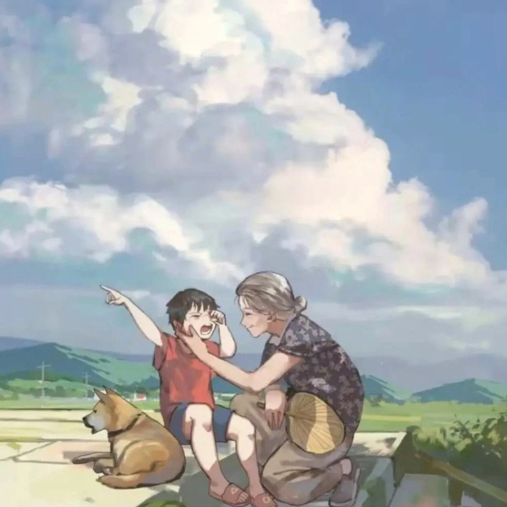

# **《云边有个小卖部》**

## 王莺莺，小气鬼

-   该小说讲述小镇青年刘十三回到表面平静却暗潮涌动的小镇，与外婆和几位发小所发生的一连串悲欢离合的故事。该小说表达了对故乡、对亲情的衷心倾诉。外婆王莺莺的乐观坚韧和无限包容，程霜像一道光一样短暂又永恒，刘十三的奋斗与卑微，云边镇迷人的自然风景、悠然的生活节奏，共同构成了云边故乡的美好意境。

[开始阅读](?id=云边有个小卖部)
